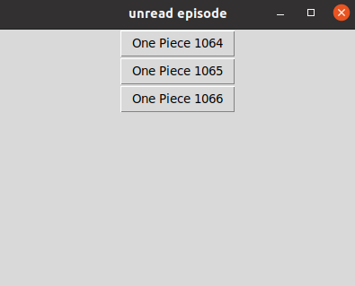

# One-Piece-Web-scraping
this program informs me when a new episode is available

    

## :ledger: Index

- [Project goal](#beginner-project-goal)
- [Future developments](#wrench-future-developments)
- [Gallery](#camera-gallery)
- [License](#lock-license)

## :beginner: Project goal
The goal of this personal project is to familiarize myself with web scraping.

This code scans a website with  one piece episode. 
It then informs me if new episodes are available.

# :wrench: Future developments
  - Add confirmation button to inform the program that I have read the new episode
  - Add a function to generalize to different websites/other episode genres##  :camera: Gallery

##  :camera: Gallery
### 1. Output example

##  :lock: License
Add a license here, or a link to it.
